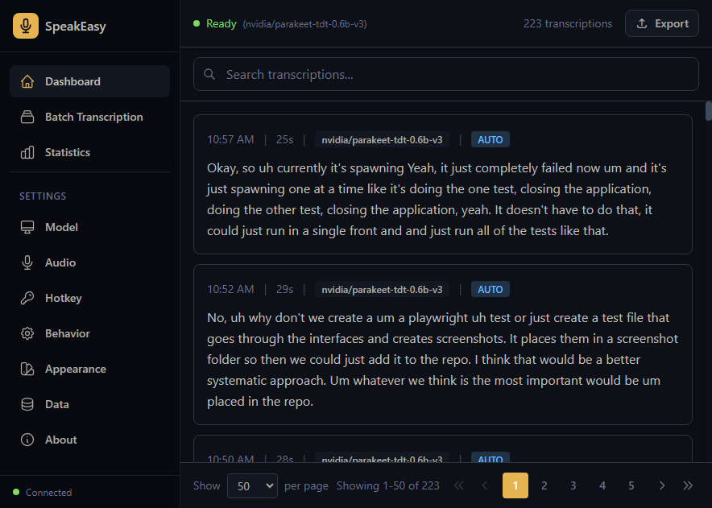

# SpeakEasy

<div align="center">
  
  <h1>SpeakEasy</h1>
  <h3>The Vibe Coding Companion</h3>
  <p>
    Code at the speed of thought. Transcribe your voice into any application.<br/>
    <b>Privately. Locally. Instantly.</b>
  </p>
  
  <p align="center">
    <a href="#-downloads">Download</a> •
    <a href="#-features">Features</a> •
    <a href="#-how-it-works">How It Works</a> •
    <a href="#-community">Community</a>
  </p>

  
  
  
  
</div>

---

## 🌊 Why SpeakEasy?

**SpeakEasy** is designed for the **vibe coding** era. When you're in the flow, typing can feel like a bottleneck. SpeakEasy removes that friction, letting you dictate code, documentation, emails, and ideas directly into your active window with near-zero latency.

Unlike cloud-based solutions that send your voice to a server, SpeakEasy runs **entirely on your machine**. Your voice data never leaves your device.

### 🚀 Built for the "Vibe Coding" Community
- **Stay in the Flow**: Don't break your train of thought to type. Just hold the hotkey and speak.
- **Code with Voice**: Perfect for commenting code, writing commit messages, or drafting documentation.
- **Total Privacy**: Corporate secrets and personal thoughts stay safe. No cloud API keys required.

## ✨ Key Features

### 🎙️ Instant Transcription
- **Universal Input**: Works in VS Code, Cursor, Slack, Discord, Obsidian, or any other app.
- **Global Hotkey**: Press a key, speak, release. Text appears instantly.
- **Smart Formatting**: Automatic punctuation and capitalization (or raw text if you prefer).

### 🧠 State-of-the-Art AI
We support the best open-source models optimized for consumer hardware:
- **OpenAI Whisper**: The gold standard for accuracy.
- **NVIDIA Parakeet/Canary**: Ultra-low latency for real-time responsiveness.
- **Mistral Voxtral**: Large language model accuracy for complex dictation.
- **GPU Acceleration**: Automatic CUDA detection for blazing fast performance on NVIDIA GPUs.

### 🛠️ Power User Tools
- **Transcription History**: Searchable database of everything you've said. Never lose an idea.
- **Batch Processing**: Transcribe hours of audio files by dragging and dropping.
- **Export Options**: JSON, TXT, SRT, VTT, and CSV exports.

## 📸 Screenshots

<p align="center">
  
</p>

## 🏁 Quick Start

### Option 1: Download the App (Coming Soon)
Check our [Releases](https://github.com/yourusername/speakeasy/releases) page for the latest installers for Windows, macOS, and Linux.

### Option 2: Run from Source

**Prerequisites:**
- Python 3.10 - 3.12 (Python 3.13+ is not yet supported)
- Node.js 18+ (LTS)
- [UV](https://github.com/astral-sh/uv) (Recommended)
- **FFmpeg**: Must be in your system PATH.
- **Windows Only**: [Visual C++ Build Tools](https://visualstudio.microsoft.com/visual-cpp-build-tools/) (Desktop development with C++ workload) - Required for some dependencies.

**Automatic Setup (Windows):**
Simply run `install.bat` in the root directory. It will install Python 3.12 and all dependencies automatically.

**Manual Setup:**

**1. Setup Backend**
```bash
cd backend
uv venv --python 3.12

# Install dependencies with GPU optimization (if NVIDIA GPU detected)
# Windows:
nvidia-smi >nul 2>&1 && uv pip install -e ".[cuda]" || uv pip install -e .

# macOS/Linux:
nvidia-smi > /dev/null 2>&1 && uv pip install -e ".[cuda]" || uv pip install -e .
```

**2. Setup Frontend**
```bash
cd ../gui
npm install
```

**3. Launch**
```bash
# Inside the gui directory
npm run dev
```

## 🏗 Architecture

SpeakEasy combines a high-performance **Python FastAPI** backend for AI inference with a sleek **Electron + React** frontend.

| Component | Tech Stack | Responsibility |
|-----------|------------|----------------|
| **Backend** | Python, PyTorch, CTranslate2 | Model inference, audio processing, database |
| **Frontend** | Electron, React, Tailwind | UI, global hotkeys, system tray |

## 🤝 Contributing

We welcome contributions from the community! Whether it's adding new models, improving the UI, or fixing bugs.

1. Fork the repo
2. Create your feature branch (`git checkout -b feature/amazing-feature`)
3. Commit your changes (`git commit -m 'Add amazing feature'`)
4. Push to the branch (`git push origin feature/amazing-feature`)
5. Open a Pull Request

## 📄 License

MIT © SpeakEasy Contributors
