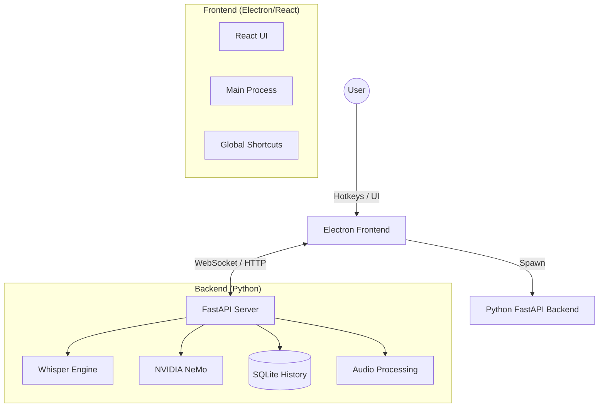

# SpeakEasy

<div align="center">
  <h3>The Ultimate Local Voice Transcription Powerhouse</h3>
  <p>
    Use state-of-the-art AI models to transcribe your voice into any application.<br/>
    <b>Privately. Locally. Instantly.</b>
  </p>
</div>

---

## 🚀 Overview

SpeakEasy is a modern desktop application that brings the power of **Whisper**, **NVIDIA Parakeet/Canary**, and **Mistral Voxtral** directly to your fingertips. 

Unlike cloud-based solutions, SpeakEasy runs entirely on your machine. Whether you're dictating emails, capturing meeting notes, or transcribing recorded interviews, SpeakEasy handles it all with zero latency and 100% privacy.

It combines a robust **Python FastAPI backend** for high-performance inference with a sleek **Electron + React frontend** for a seamless user experience.

## 📸 Screenshots

<p align="center">
  
</p>

*The modern dark-mode interface makes managing your transcriptions effortless.*

## ✨ Key Features

### 🎙️ Core Transcription
- **Universal Dictation**: Press a hotkey and start talking. Your words are typed directly into the active window.
- **Push-to-Talk & Toggle Modes**: customize how you want to control recording.
- **Smart Formatting**: Automatic punctuation, capitalization, and optional removal of filler words (um, uh).
- **Audio Device Management**: Seamlessly switch between microphones and input devices.

### 🧠 Advanced AI Models
SpeakEasy supports a wide range of models to balance speed and accuracy:
- **OpenAI Whisper**: The industry standard, powered by `faster-whisper` (CTranslate2) for blazing fast inference.
- **NVIDIA NeMo**: Support for `Parakeet` (TDT) and `Canary` (multilingual) models for ultra-low latency.
- **Mistral Voxtral**: Support for the powerful 3B parameter model for superior accuracy.
- **Hardware Acceleration**: Automatic GPU detection (CUDA) with quantization support (`float16`, `int8`, `int4`) to run large models on consumer hardware.

### 🛠️ Power User Tools
- **Transcription History**: A searchable, persistent database of everything you've ever said.
- **Batch Processing**: Drag and drop existing audio files to transcribe them in bulk.
- **Rich Export Options**: Export your history or batch jobs to **TXT**, **JSON**, **CSV**, **SRT** (Subtitles), and **VTT**.
- **Clipboard Integration**: Automatically copy transcripts to your clipboard.

## 🏗 Architecture

The project is structured as a modern hybrid application:



| Component | Tech Stack | Responsibility | Documentation |
|-----------|------------|----------------|---------------|
| **Backend** | Python, FastAPI, PyTorch, CTranslate2, SQLite | Model inference, audio processing, database, websocket server | [Backend Docs](./backend/README.md) |
| **GUI** | Electron, React, TypeScript, Vite, Tailwind | User interface, global hotkeys, window management, system tray | [GUI Docs](./gui/README.md) |

## 📦 Prerequisites

Before you begin, ensure you have the following installed:

1.  **Python 3.10+**: [Download Python](https://www.python.org/downloads/)
2.  **Node.js 18+**: [Download Node.js](https://nodejs.org/)
3.  **UV** (Highly Recommended): A fast Python package installer.
    ```bash
    # Install UV (Windows)
    powershell -c "irm https://astral.sh/uv/install.ps1 | iex"
    
    # Install UV (macOS/Linux)
    curl -LsSf https://astral.sh/uv/install.sh | sh
    ```
4.  **FFmpeg**: Required for audio processing.
    *   **Windows**: `winget install ffmpeg` (or download binaries and add to PATH)
    *   **Mac**: `brew install ffmpeg`
    *   **Linux**: `sudo apt install ffmpeg`

## 🏁 Quick Start

### 1. Set up the Backend

The backend handles all the heavy lifting.

```bash
cd backend
# Create a virtual environment and install dependencies
uv venv
uv pip install -e .
```

> **Note for GPU Users:** To enable CUDA acceleration, you may need to install the specific PyTorch version for your CUDA driver. See the [Backend README](./backend/README.md) for details.

### 2. Set up the GUI

The frontend provides the interface.

```bash
cd ../gui
# Install Node dependencies
npm install
```

### 3. Run the Application

You can run everything from the GUI directory. The Electron app is configured to automatically spawn the Python backend in the background.

```bash
cd gui
npm run dev
```

*The first launch will be slower as it downloads the default model.*

## 🎮 Usage

1.  **Select a Model**: On the Settings page, choose a model that fits your hardware (e.g., `distil-medium.en` for speed, `large-v3` for accuracy).
2.  **Configure Hotkeys**: Go to Settings > General to set your Global Record Hotkey.
3.  **Transcribe**: 
    *   Focus on any text field (Notepad, Browser, Slack).
    *   Hold your hotkey and speak.
    *   Release to transcribe and paste.

## 📄 License

MIT © 2024 SpeakEasy Contributors
